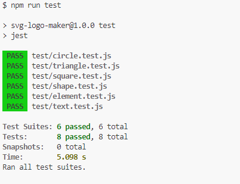
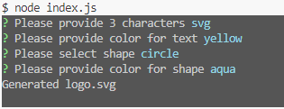

# SVG-Logo-Maker

## Description

This project try to make a tool to generate a simple logo by SVG. User can easily generate a logo with shapes: circle, square, triangle and put text with 3 characters inside chosen shape.

## Installation

- Step 1: clone project to your local computer.
- Step 2: run "npm install" to install the required modules (inquirer, jest).

## Test

To run the unit tests, please use the command npm run test.
   

    
## Usage

- Step 1: run cmd "node index.js"
- Step 2: input the 3 characters for logo.
- Step 3: input the text color keyword (OR a hexadecimal number).
- Step 4: choose the shape from list of circle, square, and triangle.
- Step 5: input the shape color keyword (OR a hexadecimal number).
- Step 6: a svg logo will be created in dist/ folder.

    

[Demo video](https://watch.screencastify.com/v/KOR5RWmkNCAYODdt5jey)

## Credits

Unit tests powered by [Jest](https://www.npmjs.com/package/jest).

Inquirer sourced from [Inquirer](https://github.com/SBoudrias/Inquirer).

## License

This project is licensed under the MIT license.